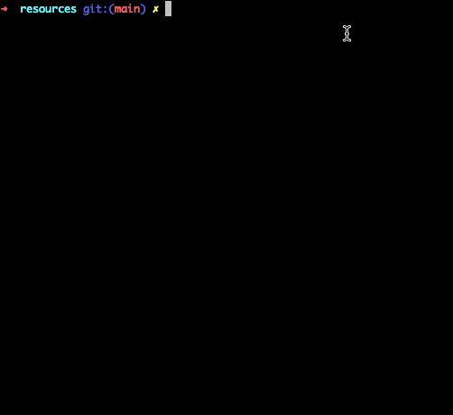

# Filler

The project aims to write a player program to compete against other players for the algorithmic Filler game. 

## Rules of the Filler game:

- The game is provided as a Ruby executable.
- Two players on a board with a known size
- Players take turns placing a piece.
- The game provides pieces. The size and shape of the piece are random.
- The game stops once a piece can no longer be placed.
- The winning player should place as many pieces as possible

## Strategy

The player needs to surround and block the opponent as soon as possible while placing the piece. 
I had two strategies to win:  
1. Calculating the distance to find the closest spot to the opponent
    - A distance map is created by calculating the distance between two points using [the Chebyshev distance formula](https://iq.opengenus.org/euclidean-vs-manhattan-vs-chebyshev-distance/)
2. Tracing the latest move of the opponent
    - For each move of the opponent, I used a counter to keep track of the coordinates of the latest move.

- A list struct is created containing the coordinates, distance, and move information of the opponent.
    - This list is sorted using distance information in ascending order and move information in descending order.
    - Start from the first element of the list and try to place the piece; if not possible to place it, go to the next element in the list.

## Sample game

My_player: O vs Opponent: X



## Usage

1. Clone the repo
```
git clone git@github.com:Bengissimo/Filler.git
```
2. Compile the project
```
make
```
3. Run the game with two players
```
cd resources
./filler_vm -p1 ../bkandemi.filler -v -f maps/map01 -p2 players/carli.filler
```
4. Use of test scripts (5 games with each player)
	- map00
	```
	./test_map00.sh
	```
	- map01
	```
	./test_map01.sh
	```
	- map02
	```
	./test_map02.sh
	```
